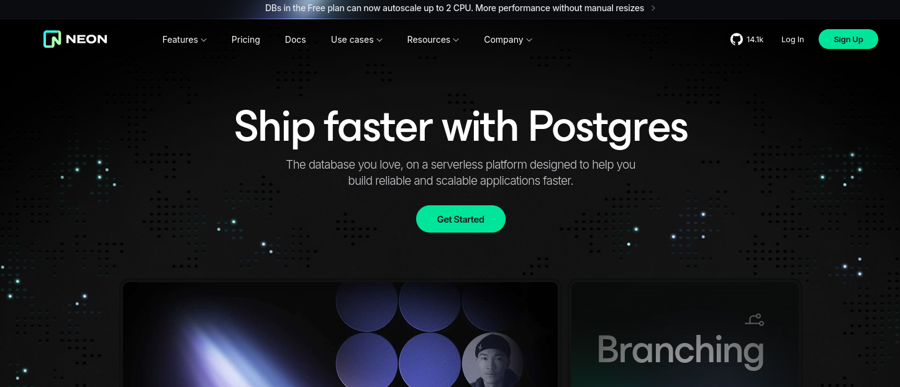

# Project Starter Kit: Neon Postgres Database with Express Typescript and TypeORM

This starter kit implemenents major CRUD Operations that you can leverage for quickly scaffolding your own models and database operations. From entity definition (Models), relationship, database configuration and initial setup with Jest so you can test your application.


Whether you're a beginning needing a quick start to work with the powerful combination of TypeScript + TypeORM + Neon Postgres + Express or an experienced developer this is the swiss knife of all starter kits.

Take advantage of Neon's Branching feature! Provide a main and development branch DATABASE_URI and the database configuration kicks in with the appropriate database using the value of the NODE_ENV variable.



All you need is your Connection string from your Neon Postgres Project!

## Features

- Neon Database - with cool feature version-controlling your database.
- NodeJS/ExpressJS
- TypeScript
- Robust Configuration for TypeORM - just provide your connection string in the .env
- Model/Entity Definition you can adapt for your needs
- Pre-configured TypeORM Datasource that links with your Postgres with code guide to generating and running migrations.
- Production Ready File Structure for easy navigation.
- Clean Set up of app for deployment/development and testing with Jest and Supertest.

## Prerequisites

- Node.js (version)
- npm
- Neon Postgres account (Get started with a Free Plan): <https://neon.tech/>

## Quick Start

### Clone the repository

```bash
git clone https://github.com/Cre8steveDev/Neon_Postgres_Express_TypeScript_TypeORM_Starter_Kit.git
```

### Change directory or you can rename the Directory

```bash
cd Neon_Postgres_Express_TypeScript_TypeORM_Starter_Kit
```

### Install dependencies

```bash
npm install
```

### Set up environmental variables

```bash
# Server
PORT=
NODE_ENV="development" # or set to production for deployment
DB_PORT=5432

# Generate NEON Postgres Connection String from Your Neon Project Dashboard
# Use the documentation guide to learn how. You can select connection pooling.
# Generate dev branch connection string (make sure to click show password)
# Before Copying the snippet
DEV_DATABASE_URI=

# This is the Main Branch for production. If you don't want to use a branch
# Just use the same Connection String for both DATABASE_URI
MAIN_DATABASE_URI=

# If you'll be using cookies # openssl rand -base64 32
COOKIE_SECRET=""
# Generate JWT Secret for signing jwt tokens (Used for Auth in this kit)
JWT_SECRET=""

```

### Generate and Run Migrations of your Models/Entity to the Database

Migrations are a safer way to sync changes you make on your models with the Database. It also allows you to easily revert to specific migration. This can be a great benefit for your application in combination with Neon Point-in-time database restoration.

1. On the root of the directory:

   ```bash
   # Generate Migration
   npx typeorm-ts-node-commonjs migration:generate ./src/typeorm/migrations/<NAME_OF_MIGRATION_FILE> -d ./src/typeorm/data-source.ts

   # Replace <NAME_OF_MIGRATION_FILE> With a name for the migration.

   ```

2. Run Migration to Sync the changes in your Models/Entities to your Database:

   ```bash
   npx typeorm-ts-node-commonjs migration:run -d ./src/typeorm/data-source.ts

   ```

### Run the application

```bash
npm run dev
# By default the server runs on http://localhost:3000
# or based on port specified in .env
```

### Set up Testing or Test the Current Application

```bash
npm run test
```

## Starter Kit Code Guide / Debugging Tips

Connection Error? Migration Tips? Read below:

[Click here to read some Tips for getting the best out of this starter kit.](./docs/README.md)

## Project Structure

This Starter Kit follows a structured approach to organize code and resources. Here's an overview of the main directories and files:

```bash
project_root
├── docs/                  # Documentation files
├── src/                   # Source files
│   ├── controllers/       # Request handlers
│   ├── middleware/        # Express middleware
│   ├── routes/            # API routes
│   ├── typeorm/           # TypeORM related files
│   │   ├── config/        # TypeORM configuration
│   │   ├── entities/      # TypeORM entities
│   │   ├── migrations/    # Database migrations
│   │   ├── connectDB.ts   # Database connection setup
│   │   └── data-source.ts # TypeORM data source configuration
│   ├── types/             # TypeScript type definitions
│   ├── utils/             # Utility functions and helpers
│   ├── index.ts           # Application entry point
│   └── setUpApp.ts        # Express app setup
├── tests/                 # Test files
├── .env                   # Environment variables
├── .gitignore             # Git ignore file
├── jest.config.js         # Jest configuration
├── package.json           # Project dependencies and scripts
├── tsconfig.json          # TypeScript configuration
└── README.md              # Project documentation
```

## Database Configuration and Settings

You can find the database configuration within the typeorm directory.

## API Endpoints

Test Current Endpoints on Postman (Use your local host as baseURL)

[](https://app.getpostman.com/run-collection/31522917-54350f46-dd5e-4a62-9dc2-4346a7879692?action=collection%2Ffork&source=rip_markdown&collection-url=entityId%3D31522917-54350f46-dd5e-4a62-9dc2-4346a7879692%26entityType%3Dcollection%26workspaceId%3D212c8589-8dd4-4f19-9a53-e77403c6c7d9)

## Testing

Create your tests within the tests/ directory and run `npm run test`. You can update the test script within the package.json script object.

## Upcoming Update

Interactive CLI Tool allowing you to choose between bootstrapping a config-only project or the full project with the Guide and Code Sample.

## Contributing

Guidelines for contributions coming soon. Till then, happy coding!

## License

[MIT LIcense](./LICENSE)

## 🙏 Acknowledgements

Thanks to Neon for hosting this challenge and providing an amazing Postgres platform!

Project Link: <https://github.com/Cre8steveDev/Neon_Postgres_Express_TypeScript_TypeORM_Starter_Kit>

Challenge Link: <https://dev.to/t/neonchallenge>
