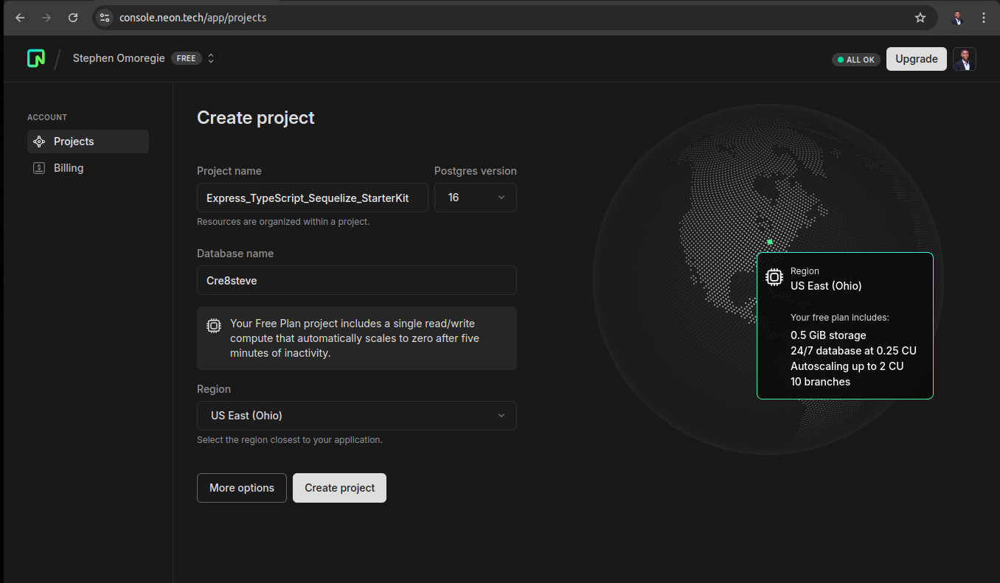

# Code Guide / Documentation

## Debbuging Connection Error

If you're getting this error:

```bash
AggregateError
   at internalConnectMultiple (node:net:1117:18)
   at internalConnectMultiple (node:net:1185:5)
   at Timeout.internalConnectMultipleTimeout (node:net:1711:5)
   at listOnTimeout (node:internal/timers:575:11)
   at processTimers (node:internal/timers:514:7) {
 code: 'ETIMEDOUT',
 [errors]:

 with a bunch of Ipv6 looking addresses....
```

A. Confirm that your network connection is stable.

B. Stop the Development Server and restart with `npm run dev`

C. Disable IPv6 with the commands below

```bash
sudo sysctl -w net.ipv6.conf.all.disable_ipv6=1
sudo sysctl -w net.ipv6.conf.default.disable_ipv6=1
sudo sysctl -w net.ipv6.conf.lo.disable_ipv6=1
```

## Migrations

When you make changes to your Model/Entity, you can run create a migration file and then run migrations to update your table. **Make sure to run the comands below on the root of your project or you can adjust the relative paths accordingly**.

### Generate a Migration File

```bash
npx typeorm-ts-node-commonjs migration:generate ./src/typeorm/migrations/<NAME_OF_MIGRATION_FILE> -d ./src/typeorm/data-source.ts
```

### Run all Pending Migrations

```bash
npx typeorm-ts-node-commonjs migration:run -d ./src/typeorm/data-source.ts
```

### Revert Migration

The command below will revert the last migration you made. You can revert multiple migrations in the order in which they were made by running the command multiple times.

```bash
npx typeorm-ts-node-commonjs migration:revert  -d ./src/typeorm/data-source.ts
```

## Preventing SQL Injection and Sanitizing User Input

Don't blindly trust your user 🤣

1. Although TypeORM has built-in support for parameterized queries and automatically escapes input values (<https://typeorm.io/select-query-builder#using-parameters-to-escape-data>) you can, nope, YOU SHOULD also use a simple library like `sanitize` to clean user input and prevent SQL injection. Note that the sanitize library not only protects against SQL injection but also removes any HTML tags, JavaScript code, and other potentially harmful content.
2. `express-validator`: `npm install express-validator`

## Creating a Project or Branch for your Neon Postgres Database

Creating a Project


Main Branch/Default Database Connection Config


After Creating a dev branch, copy the connection string


## Quick Guide for TypeORM - Explore the TypeORM docs for optimizing your Entity/Models

<https://typeorm.io/>
